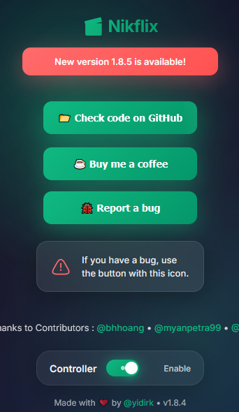

<p align="center">
  
</p>

# Netflix Password-Sharing (Household) Bypass Extension

An open-source browser extension that allows bypassing Netflix's password-sharing (Household) restrictions.

If you like this project, consider giving it a ⭐ or supporting it with a tip!

---


## 📥 Installation on Chrome, Edge, Brave, and other Chromium-based browsers

[](https://chromewebstore.google.com/detail/nikflix/knjoabokknkpkhbbdclmnjcoeedmgema?hl=en-GB&authuser=0)

[](https://chromewebstore.google.com/detail/nikflix/knjoabokknkpkhbbdclmnjcoeedmgema?hl=en-GB&authuser=0)

[](https://chromewebstore.google.com/detail/nikflix/knjoabokknkpkhbbdclmnjcoeedmgema?hl=en-GB&authuser=0)

---

## 📥 Installation on Firefox

[](https://addons.mozilla.org/firefox/addon/nikflix/)

[](https://addons.mozilla.org/firefox/addon/nikflix/)

[](https://addons.mozilla.org/firefox/addon/nikflix/)

---

## 🌐 Website

Visit our website:

https://nikflix.hergol.me

---

# ✨ Features

- Bypass Netflix Household restrictions.
- Works directly in your browser.
- No complex configuration required.
- Supports Chromium-based browsers and Firefox.
- Open source.
- Modern TypeScript codebase powered by WXT.

<p align="center">
  
</p>

---

# 📝 Changelog

## [2.0.5] - 2026-08-26

### 🔀 Hybrid API & CSS Block System

* ✓ **Hybrid blocking system for API Block mode**:

  * The **Menu** now uses the **CSS Block** system to preserve Netflix's native menu functionality.
  * The **Watch** page switches to the **API Block** system, allowing the original Netflix controller to be used.
  * Fixes issues reported in:

    * [#134](https://github.com/YidirK/Nikflix/issues/134)
    * [#133](https://github.com/YidirK/Nikflix/issues/133)
    * [#131](https://github.com/YidirK/Nikflix/issues/131)

### ⏱️ Timestamp Preservation

* ✓ **Added a timestamp preservation system**:

  * Netflix changed part of its internal code, which could break the original controller.
  * Nikflix now saves the relevant timestamp in `localStorage` before Netflix removes it.
  * This allows the controller to continue working correctly.
  * This fix is related to [#132](https://github.com/YidirK/Nikflix/issues/132).
  * ⚠️ **This system is still being tested** and may require further improvements.

## [2.0.4] - 2026-08-17

### 🎬 Complete Player & UI Redesign

* ✓ **Smart Skip Intro & Skip Outro / Next Episode**:

  * Parses intro and outro/credits markers from Netflix's metadata API (`memberapi`).
  * Floating Netflix-styled action buttons appear dynamically during intro and ending credits windows.
* ✓ **All-New Netflix-Style Episodes & Seasons Modal**:

  * Season selector dropdown with instantaneous episode filtering.
  * 16:9 episode thumbnails with duration badges, synopsis preview, and active "En cours" playing indicator with auto-scroll.

---

# 🌍 Translation

Want to translate Nikflix?

1. Go to the `_locales` folder.
2. Create a folder using your language code (`fr`, `es`, `de`, etc.).
3. Add a `messages.json` file.
4. Copy an existing translation.
5. Translate the values.

Example:

```text
_locales/
├── en/
│   └── messages.json
├── fr/
│   └── messages.json
```

---

## 👥 Contributors

<a href="https://github.com/YidirK/Nikflix/graphs/contributors">
  
</a>

---

## 💬 Technical Note

Nikflix offers two blocking modes so users can choose what works best for them:

- **CSS & DOM Block (Recommended)**: Modifies the page element display after Netflix renders content. It leaves network traffic untouched, making it legally safer and less detectable.
- **API Block**: Intercepts the `CLCSInterstitialPlaybackAndPostPlayback` GraphQL endpoint (`web.prod.cloud.netflix.com/graphql`) on `/watch` pages while running CSS DOM cleanup on Home/Browse so movie title modals open seamlessly. Special thanks to **@Buckibarnes17** for the inspiration on this approach.


---
## Note 
Just to clarify: Nikflix does not request or use the "browsing history" permission.

The current version only asks for:
- storage (to remember your preferred blocking mode)
- tabs (to open the onboarding page and communicate with Netflix tabs)
- declarativeNetRequestWithHostAccess (to optionally block the Netflix restriction API)
- Access limited to Netflix domains only

No history / browser history permission is declared in the manifest, and the code never reads your browsing history.

Sometimes browsers show a slightly misleading warning when an extension updates (especially with the tabs permission). That’s likely what you saw.
## 🤝 Contributing

Contributions are always welcome!

Whether it's:

- Fixing bugs
- Improving compatibility
- Adding new translations
- Refactoring code
- Improving documentation

Feel free to open an Issue or submit a Pull Request.

---

## ⚠️ Disclaimer

This extension may violate Netflix's Terms of Service.

Use it at your own risk.

---

## 📄 License

This project is released under the LICENSE included in this repository.

---

### ⭐ Enjoying Nikflix?

If this project helped you, please consider giving it a GitHub ⭐.

You can also support future development with a small donation.

[](https://ko-fi.com/S6S61G68F3)