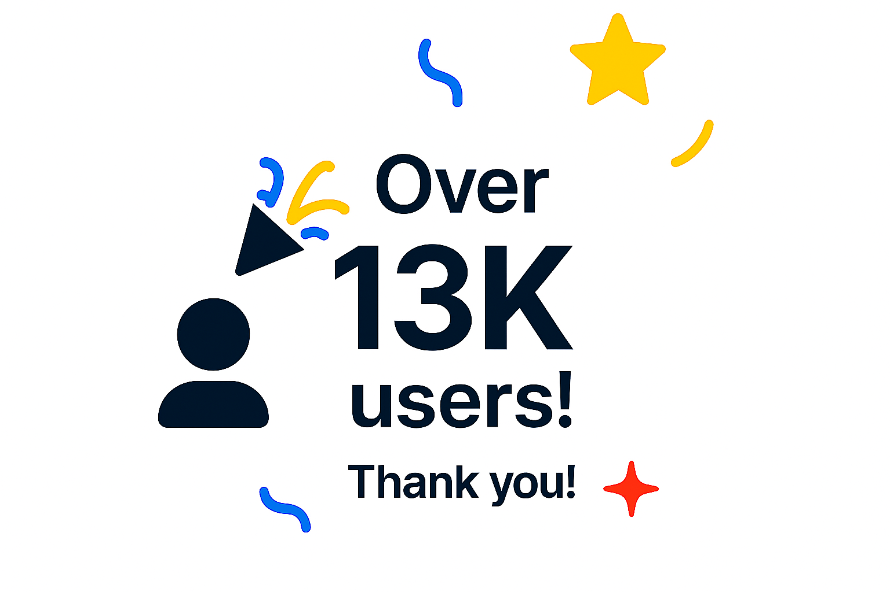

  

# Netflix Password-Sharing (household) Bypass Extension

An extension that allows bypassing Netflix's password-sharing restrictions.
If you like this project, consider giving it a star ⭐ or a tip if you feel generous!

## 📥 Installation on Chrome, Edge, Brave , or any other Chromium-based browser

## 📥 Installation on Firefox Browser

----

## ✨ Features

- Bypasses Netflix account-sharing restrictions
- Works directly in the browser with no complex configuration
-  Get Around the Netflix Password-Sharing Ban (Netflix household).

  

----

# 📝 Changelog
## [1.8.7] - 2025-08-25

### 🛠️ Fix

- The player now starts playing content automatically when you launch an episode.  [issues #23](https://github.com/YidirK/Nikflix/issues/23)

- Added a toggle state to the button for enabling or disabling the extension's controller. [issues #45](https://github.com/YidirK/Nikflix/issues/45)

- Added a new button in the extension popup to help if you encounter a bug. [issues #48](https://github.com/YidirK/Nikflix/issues/48)

- Added my email in the popup so you can contact me in case of issues.

- Now, when you disable the controller using the popup button, it allows you to click on the button to view the credits. [issues #41](https://github.com/YidirK/Nikflix/issues/41)

## 👥 Contributors
 

## 💬 Note
Several people have contacted me to inform me about a technique that directly blocks Netflix API, which is used to check whether you are part of the Netflix household.
However, I prefer not to use this method for two reasons:
- It doesn’t always work, and its effectiveness depends on the region.
- From a legal standpoint, my extension is less risky because we simply modify the content that has already been sent and add our own content on top. We don’t block any requests, which is legally safer. I wanted to avoid any legal issues for myself and also protect my users from being banned.
##  🤝 Contributing
Contributions are welcome! Feel free to submit a Pull Request or report an issue.

## ⚠️ Disclaimer

This extension may violate Netflix's terms of service. Use at your own risk.

---

## 📄 License
This project is licensed under the MIT License - see the LICENSE file for details.

---
### ⭐ Enjoying the extension? Show your support with a star — or a tip if you feel generous! ⭐

